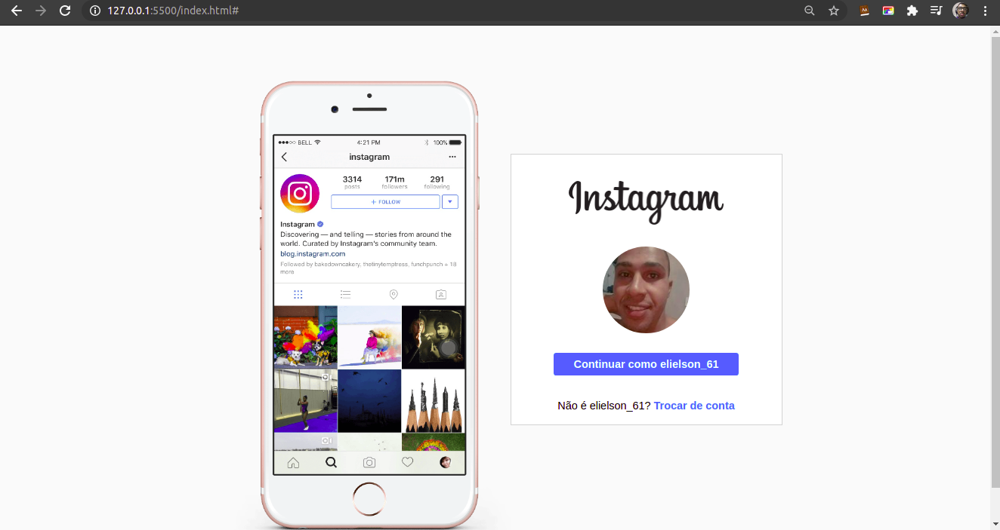
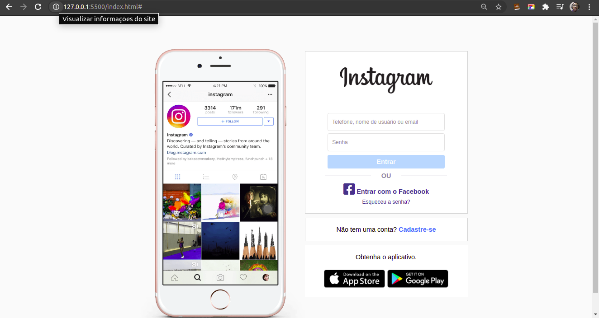

<h1 align="center">Clone-Instagram</h1>
<table>
  <tr>
    <td></td>
    <td></td>
  </tr>
</table>

<h2> :information_source: Sobre</h2>

O projeto é fazer um clone com todas as tela do Instagram, mas para iniciar fiz a landing page como a tela para continuar com o usuario ou até fazer login com um outra conta.

## :rocket: Tecnologias Utilizadas 
  - HTML
  - CSS
      - Com uso de muito flex box
  - JS
